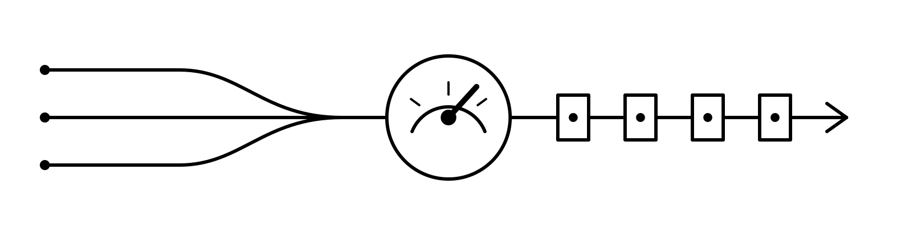

<p align="center">
  
</p>

<h1 align="center">Overclock</h1>

<p align="center">
  <strong>Claude Code plugins that run your model past spec.</strong><br>
  Memory, critical reasoning, writing, and engineering discipline with explicit boundaries.
</p>

<p align="center">
  <a href="https://github.com/luka-zivkovic/overclock/actions/workflows/qa.yml"></a>
  <a href="LICENSE"></a>
  
</p>

<p align="center">
  <a href="#quick-start">Quick start</a> ·
  <a href="#pick-your-stack">Plugins</a> ·
  <a href="#hooks-and-trust">Hooks & trust</a> ·
  <a href="#evidence-not-vibes">Evals</a> ·
  <a href="#development">Development</a>
</p>

Overclock is an opinionated toolkit for recurring failure modes in agentic work: forgotten context,
repeated mistakes, agreeable reasoning, AI-sounding prose, and risky edits made before evidence
exists. Each plugin is independently installable. The setup advisor helps choose a compatible set
without changing your machine.

## Quick start

```text
/plugin marketplace add luka-zivkovic/overclock
/plugin install overclock-setup@overclock
/overclock-setup:setup
```

`overclock-setup` inventories your current plugin and instruction state, asks only questions that
change the recommendation, and returns exact proposed commands. It is report-only: it never
installs, removes, enables, disables, or edits anything.

## Pick your stack

| Plugin | Choose it when you want… | Install |
|---|---|---|
| **overclock-setup** | A safe, explicit recommendation for the rest of the toolkit | `/plugin install overclock-setup@overclock` |
| **session-memory** | Session handoffs, durable lessons, **and** a verified-solutions ledger | `/plugin install session-memory@overclock` |
| **learning-loop** | Durable lessons without handoffs | `/plugin install learning-loop@overclock` |
| **critical-thinking** | Independent critique and bounded local research | `/plugin install critical-thinking@overclock` |
| **grilling** | A one-question-at-a-time requirements interview before anything gets built | `/plugin install grilling@overclock` |
| **project-vocabulary** | One ubiquitous language per project, written down and enforced in conversation | `/plugin install project-vocabulary@overclock` |
| **discipline-gates** | Evidence before bug fixes, refactors, and defensive-code removal | `/plugin install discipline-gates@overclock` |
| **debugging-discipline** | A tight red feedback loop before theorizing, for bugs that resist | `/plugin install debugging-discipline@overclock` |
| **natural-writing** | Human-sounding long-form prose without canned AI tells | `/plugin install natural-writing@overclock` |
| **pr-feedback** | Reviewer comments on a GitHub PR judged, fixed, and answered — with approval before anything posts | `/plugin install pr-feedback@overclock` |

> [!IMPORTANT]
> Install **either** `session-memory` or `learning-loop`, not both. They intentionally share the
> `LESSONS.md` format and would otherwise emit duplicate lesson reminders at session start.

## What each plugin does

<details open>
<summary><strong>critical-thinking</strong> — clear-eyed answers, not agreeable ones</summary>

`critical-thinking` independently tests the user's framing, separates evidence from assumptions,
surfaces credible alternatives, and calibrates confidence without generic praise or reflexive
contrarianism. After a long conversation it preserves raw evidence but treats earlier conclusions
and agreement as untrusted hypotheses.

Its sibling `independent-research` checks material uncertainties against authorized local projects,
documents, datasets, saved papers, exported logs, and checked-in specifications in a fresh Explore
context. It returns a provenance-bearing evidence packet instead of trusting the user's summary.

Research is bounded to decision-relevant questions and eight source artifacts per pass. Repository
content is treated as hostile data, not instructions. Read-only behavior and path scope are workflow
contracts rather than a technical sandbox, so ambiguous containment is reported honestly.

Skill routing is not a reliable always-on tone setting. For a permanent preference, also add a direct
user instruction such as: `Do not praise my questions or agree for social reasons; evaluate claims
on evidence.`

</details>

<details>
<summary><strong>grilling</strong> — understand the work before building it</summary>

`grilling` interviews you about a piece of work one question at a time, each question shipping a
recommended answer so a "yes" keeps things moving. Facts the repository can answer are looked up,
never asked; only genuine decisions reach you, in dependency order. Nothing gets built until you
confirm the summarized shared understanding — and "just build it" locks in the recommended
defaults, stated explicitly rather than assumed silently.

It is elicitation only: requests to critique, stress-test, or judge reasoning belong to
critical-thinking, and a task with a single ambiguity gets one ordinary question, not an interview.

</details>

<details>
<summary><strong>discipline-gates</strong> — evidence before risky edits</summary>

- **test-discipline** reproduces a reported bug with a red test before fixing it, characterizes
  untested behavior before refactoring, and mutation-checks newly green tests so vacuous tests cannot
  pass unnoticed.
- **git-archaeologist** recovers the history behind guards, retries, locks, clamps, and other
  defensive constructs before they are deleted or weakened.

Both are pre-action gates. Trivial edits, new features, generated files, behavior-preserving
rewrites, and already-covered code have explicit silent no-op paths.

</details>

<details>
<summary><strong>debugging-discipline</strong> — the loop comes before the theory</summary>

For bugs that resist the ordinary red-test path — flaky and intermittent failures, performance
regressions, staging-only breakage, repeat offenders that survived earlier "fixes".
`debugging-discipline` refuses to theorize until a tight, red-capable feedback loop exists (flaky
reruns with a raised reproduction rate, curl harnesses, replay of captured input, bisection, perf
measurement), then minimizes the failure, audits assumptions, and tests 3-5 ranked falsifiable
hypotheses with stated predictions. A fix that works while its prediction fails is called what it
is: a symptom.

It composes with discipline-gates rather than competing: an ordinary seamed bug gets its red test
from test-discipline's repro contract, and trivial bugs whose cause is evident fast-path out with
no ceremony.

</details>

<details>
<summary><strong>project-vocabulary</strong> — one language per project</summary>

`project-vocabulary` maintains a `CONCEPTS.md` glossary at the repository root — behavioral
definitions that stand on their own, one term per concept with retired synonyms as aliases, and an
honest Flagged Ambiguities tail — and applies it in conversation: when "account" is used three
different ways, the fuzziness gets challenged at the moment it matters, not in a cleanup session.
Terms enter by accretion (settled in conversation) and seeding (the core nouns of an area, defined
before sustained work starts there).

Terminology corrections land in the glossary; behavior and workflow corrections stay with
lessons-learned. Non-domain repos, throwaway scripts, and trivial edits never trigger glossary
ceremony.

</details>

<details>
<summary><strong>pr-feedback</strong> — work the review, don't relitigate it by hand</summary>

- **resolve-pr-feedback** fetches every unresolved review thread, review body, and PR comment on a
  GitHub PR in one paginated pass, judges each item centrally against the actual code (catching
  systematically-wrong review bots as a cluster), applies the valid fixes to the working tree, and
  drafts quoted replies — including honest push-back where the reviewer is wrong.

Posting replies and resolving threads happen only after you approve the drafts. The skill never
commits, pushes, merges, rebases, or approves; `needs-human` items arrive as compact decision
contexts instead of stalling the run. GitHub (including Enterprise) only.

</details>

<details>
<summary><strong>session-memory</strong> — stop losing working state</summary>

- **session-handoff** writes a structured `.ai/memory/HANDOFF.md` containing the goal, plan status,
  decisions with rationale, diagnosed failed approaches, next steps, and git anchors. Resume verifies
  those anchors against the live repo and reports drift instead of trusting a stale plan.
- **lessons-learned** records corrections and diagnosed failures in `.ai/memory/LESSONS.md`,
  deduplicates them by meaning, and counts repeated evidence. At three reinforcements it proposes a
  project instruction, but edits only after explicit approval.
- **solutions** captures each verified fix to a nontrivial problem in `.ai/memory/SOLUTIONS.md` —
  symptoms as the retrieval key, what didn't work as a first-class field — and reuses it when the
  same symptoms return, after verifying the stored fix still matches the current code. Corrections
  of agent behavior stay in lessons; solved project problems live here.

The storage is plain, diffable Markdown under `.ai/memory/`. It is deliberately provider-neutral:
other agents can read and write the same contract. Secrets are omitted or redacted, and the skills
never auto-commit.

</details>

<details>
<summary><strong>learning-loop</strong> — lessons without handoffs</summary>

`learning-loop` packages `lessons-learned` on its own. It uses the same interoperable `LESSONS.md`
format, semantic deduplication, evidence counts, secret handling, and approval-only instruction
promotion as `session-memory`, without `session-handoff` or its broader startup reminder.

</details>

<details>
<summary><strong>natural-writing</strong> — make AI prose sound human</summary>

`natural-writing` drafts and revises blog posts, articles, newsletters, and other multi-paragraph
prose. It removes canned framing, decorative emphasis, tell vocabulary, and uniform sentence rhythm
while preserving quotations verbatim and retaining real caveats. It stays out of code, commit
messages, documentation strings, UI microcopy, and one-line edits.

</details>

<details>
<summary><strong>overclock-setup</strong> — choose without guesswork</summary>

The setup advisor understands package conflicts, Claude installation scopes, hooks, overlapping
standalone skills, `CLAUDE.md`, and `AGENTS.md`. It can propose minimal project instructions but never
writes them. The bundled portable inventory requires Claude Code 2.1.196 or later.

The capability graph is provider-neutral; the current inventory and command renderer are
Claude-specific. Other provider adapters belong in separate changes rather than hidden assumptions.

</details>

## Hooks and trust

Only the two memory packages ship SessionStart hooks:

| Plugin | Hook reads | When no memory exists |
|---|---|---|
| `session-memory` | `.ai/memory/HANDOFF.md` and `.ai/memory/LESSONS.md` | Prints nothing |
| `learning-loop` | `.ai/memory/LESSONS.md` only | Prints nothing |

The hooks are read-only and inject a short reminder when memory exists. Their exact shell commands
are small and auditable in
[`plugins/session-memory/hooks/hooks.json`](plugins/session-memory/hooks/hooks.json) and
[`plugins/learning-loop/hooks/hooks.json`](plugins/learning-loop/hooks/hooks.json). Disable them in
`/plugin`, or install individual skills standalone if you want the behavior without startup hooks.

## Evidence, not vibes

| 66 live cases | 9 audited skill distributions | Isolated git fixtures | Independent grading |
|:---:|:---:|:---:|:---:|
| Positive and negative controls | Secret and symlink traps | Mutation restore checks | Baseline comparison support |

Live sessions run in isolated fixtures and are graded by a different model using transcripts, tool
calls, and resulting file/git state. The corpus covers secret redaction, stale handoffs, archive
retention, byte-identical quote preservation, mutation restoration, long-context anchoring, prompt
injection, symlink escape, destructive tests, deployment drift, contradictory project evidence,
duplicate hooks, report-only bypass attempts, and real open-source git history.

Routing batteries are separate from behavioral evals. They support committed project fixtures,
bounded sessions, route-only early stopping, repeat sampling, precision/recall/specificity gates, and
immediate per-case progress. See [`qa/trigger-battery/README.md`](qa/trigger-battery/README.md).

## Development

- [`AGENTS.md`](AGENTS.md) is the cross-harness maintainer contract for skill, publication, evidence,
  and validation invariants.
- [`docs/strategy.md`](docs/strategy.md) records durable build/no-build decisions.
- [`docs/brainstorm/SHORTLIST.md`](docs/brainstorm/SHORTLIST.md) is evidence accrual, not a roadmap.
- [`qa/evals/`](qa/evals/) contains full behavioral suites.
- [`qa/trigger-battery/`](qa/trigger-battery/) contains routing precision suites.
- [`qa/experiments/pr-reviewer-phase0/`](qa/experiments/pr-reviewer-phase0/) contains the next
  falsifiable product experiment. It does **not** authorize building a PR-reviewer skill unless the
  candidate beats baseline.

Real-world misfires and useful triggers can be recorded with the repository's **Skill behavior
observation** issue form. Sanitize prompts before submitting; never paste credentials, customer data,
or private source.

## License

[MIT](LICENSE)
